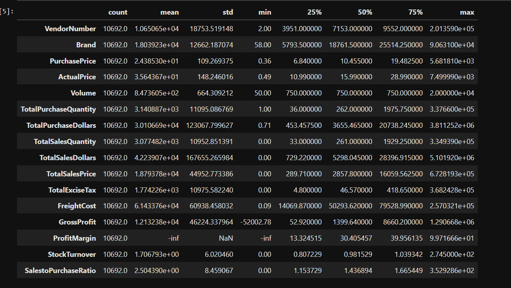
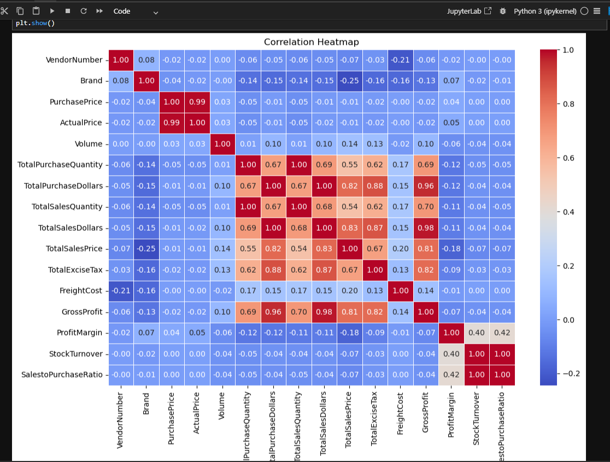
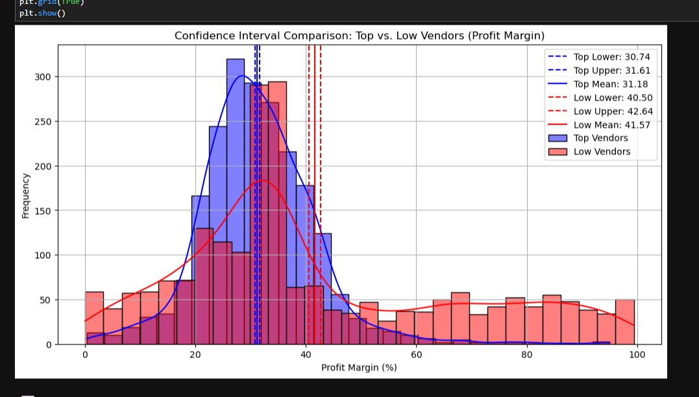
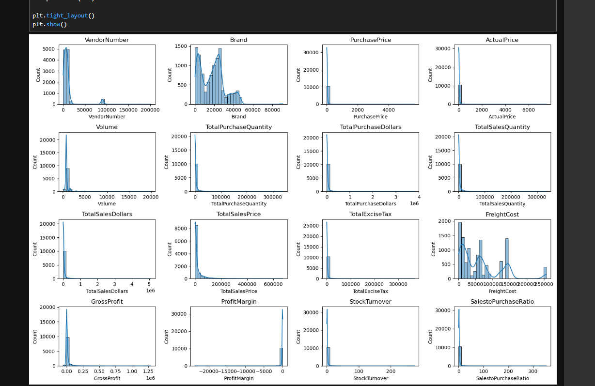
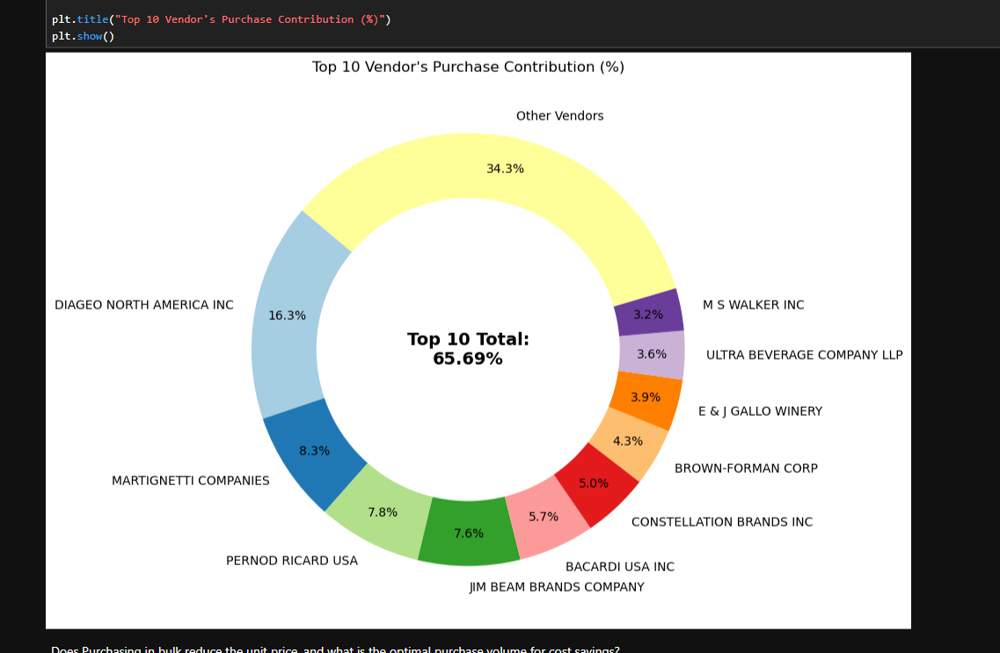
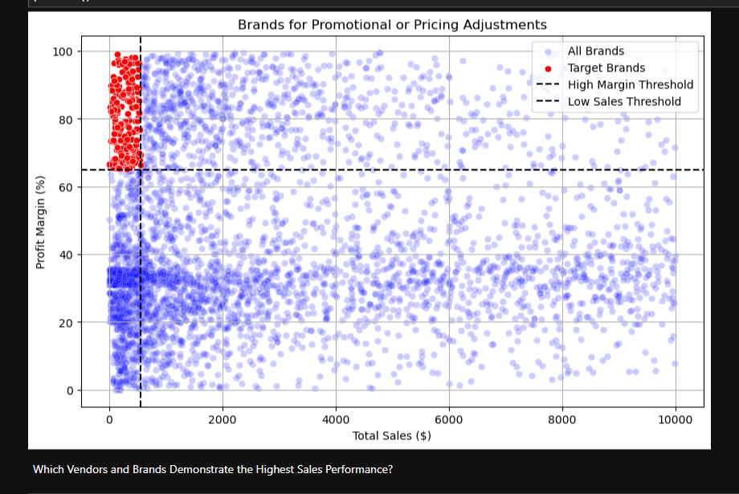
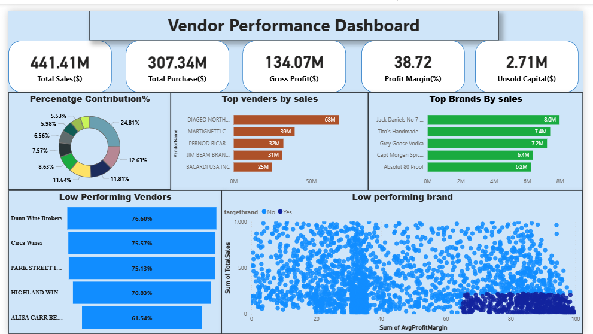

# 📊 Vendor Performance Analysis

## 📌 Project Overview
This project analyzes vendor and brand performance to optimize sales, profitability, and inventory efficiency in a retail/wholesale business.

The analysis focuses on identifying:
- Top-performing vendors contributing to revenue
- Underperforming brands requiring attention
- Profitability differences across vendors
- Vendor dependency risks

---

## 🎯 Business Problem
Effective inventory and sales management are critical for optimizing profitability. Businesses often face challenges such as:
- Inefficient pricing strategies  
- Poor inventory turnover  
- Over-dependence on a few vendors  

This project aims to:
- Identify underperforming brands for pricing/promotion  
- Determine top vendors contributing to sales and profit  
- Analyze bulk purchasing impact  
- Compare high vs low-performing vendors  

---

## 🛠️ Tools & Technologies
- Python (Pandas, NumPy)  
- Matplotlib & Seaborn  
- SciPy (Statistical Testing)  
- Power BI (Dashboard)  
- Jupyter Notebook  

---

## 📂 Dataset
The project uses a processed dataset:

👉 `vendor_sales_summary.csv`

This dataset is derived from multiple large raw datasets (sales, purchases, inventory).  
Due to size limitations, raw datasets and database files are not included.

---

## 📊 Key Analysis & Visualizations

### 🔹 Exploratory Data Analysis

- Data distribution shows strong skewness in sales and purchase values  
- Presence of outliers in profit and cost-related features  

---

### 🔹 Correlation Heatmap

- Strong positive correlation between:
  - Total Sales & Gross Profit  
  - Purchase & Sales metrics  
- Weak correlation between Profit Margin and Sales  

---

### 🔹 Histogram Analysis

- Most variables are right-skewed  
- Indicates presence of high-value outliers  

---

### 🔹 Confidence Interval Analysis

- Low-performing vendors have higher profit margins  
- Top vendors operate on lower margins but higher volume  

---

### 🔹 Vendor Contribution (Donut Chart)

- Top 10 vendors contribute ~65% of total purchases  
- Indicates dependency on limited vendors  

---

### 🔹 Scatter Plot (Brand Performance)

- Identifies high-margin but low-sales brands  
- Highlights potential growth opportunities  

---

### 🔹 Power BI Dashboard

Dashboard includes:
- KPI cards (Sales, Purchase, Profit, Margin)  
- Top vendors and brands  
- Vendor contribution analysis  
- Low-performing vendors  
- Scatter-based brand insights  

---

## 💡 Key Insights

- A small number of vendors dominate total purchases  
- High-performing vendors rely on volume rather than margin  
- Low-performing vendors have higher margins but lower sales  
- Several brands have high profitability but low visibility  

---

## 🚀 Recommendations

- Diversify vendor base to reduce dependency risk  
- Promote high-margin, low-sales brands  
- Optimize pricing strategies  
- Improve inventory turnover using demand planning  

---

## ⚠️ Limitations

- Raw datasets not included due to size  
- Some anomalies in Profit Margin (infinite/negative values)  
- No time-series analysis performed  

---

## 📄 Project Files

- 📄 Report: `reports/Vendor_Performance_Report.pdf`  
- 📊 Presentation: `reports/Vendor_Performance_Presentation.pptx`  

---

## 👨‍💻 Author
**Mohd Farhan**  
Aspiring Data Analyst | Python • SQL • Power BI  

---

## ⭐ If you like this project, consider giving it a star!
